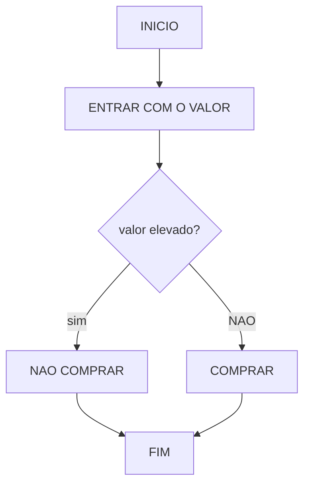

# Python-AI-Backend-Develop

teste do mermaid

```mermaid
graph TD
A[INICIO] --> B[ENTRAR COM O VALOR]
B --> C{valor elevado?} 
C -->|sim| D[NAO COMPRAR]
C -->|NAO| E[COMPRAR]
D --> F[FIM]
E --> F[FIM]


```
   